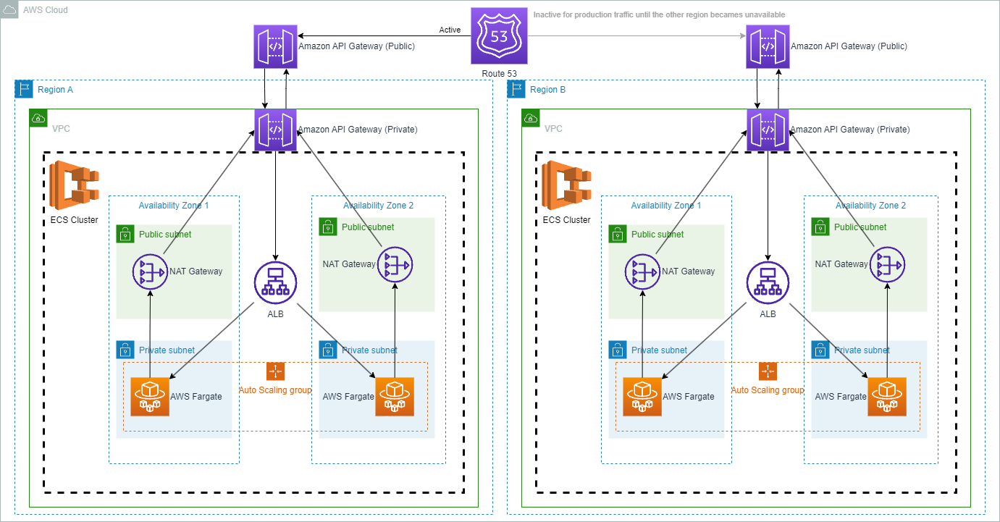

	<h1 align="center">Pokemon API ⚡</h1>

  <a href="#-project">Project</a>&nbsp;&nbsp;&nbsp;|&nbsp;&nbsp;&nbsp;
  <a href="#-must-have">Must-Have</a>&nbsp;&nbsp;&nbsp;|&nbsp;&nbsp;&nbsp;
  <a href="#-bonus">Bonus</a>&nbsp;&nbsp;&nbsp;|&nbsp;&nbsp;&nbsp;
  <a href="#-improvement-points">Improvement Points</a>&nbsp;&nbsp;&nbsp;|&nbsp;&nbsp;&nbsp;
  <a href="#-aws-architecture">AWS Architecture</a>&nbsp;&nbsp;&nbsp;|&nbsp;&nbsp;&nbsp;
  <a href="#-resources">Resources</a>&nbsp;&nbsp;&nbsp;|&nbsp;&nbsp;&nbsp;
  <a href="#-technologies">Technologies</a>&nbsp;&nbsp;&nbsp;|&nbsp;&nbsp;&nbsp;
  <a href="#-requirements">Requirements</a>&nbsp;&nbsp;&nbsp;|&nbsp;&nbsp;&nbsp;
  <a href="#-how-to-run">How to Run</a>&nbsp;&nbsp;&nbsp;|&nbsp;&nbsp;&nbsp;
  <a href="#️-work-environment">Work Environment</a>&nbsp;&nbsp;&nbsp;|&nbsp;&nbsp;&nbsp;
  <a href="#-how-to-contribute">How to contribute</a>&nbsp;&nbsp;&nbsp;|&nbsp;&nbsp;&nbsp;
  <a href="#-license">License</a>

 

  

 

## 💻 Project
The ***Pokemon API*** is an application that uses **Node** and **Typescript**, ***with the purpose to achieve my goal which is to become a ZRPenha***💙. The API retrieves *Pokemon's info* from *PokeAPI* and returns the abilities in *alphetical order*. Made with **Node**, **Typescript**, **Docker** and **Express**.

## ✅ Must-Have

✔️ You should implement an application to retrieve pokemon' abilities from PokeAPI and return it in alphabetical order(**This application must provide an HTTP REST API to attend the requirements**).\
✔️ You should create the architecture focusing on **lower latency**, **higher avaliability** and **lower cost**.

## 🎉 Bonus
- [**API's Deploy on Fly.io**](https://ts-node-pokemon-api.fly.dev/api/pokemons/ekans)
- [**API's Documentation at Postman**](https://documenter.getpostman.com/view/11958037/2s946k7WjY)
- Unit tests with [**Jest**](https://jestjs.io/)
- Integration tests with [**Supertest**](https://www.npmjs.com/package/supertest)
- Project Environment using [🐳 **Docker**](https://www.docker.com/get-started) and [**Docker Compose**](https://docs.docker.com/compose/install/)
- Code linting with [**ESLint**](https://eslint.org/)
- Code formatting with [**Prettier**](https://prettier.io/)

## 💪 Improvement Points

- Implement AWS architecture with Terraform
- Improve test coverage
- Implement logging
- Add rate limiting

## 📐 AWS Architecture
<h1 align="center">
    
</h1>

## 📦 Resources
- [**API's Deploy on Fly.io**](https://ts-node-pokemon-api.fly.dev/api/pokemons/ekans)
- [**API's Documentation at Postman**](https://documenter.getpostman.com/view/11958037/2s946k7WjY)

## 🚀 Technologies

This project was developed with the following technologies:

- [**NodeJS**](https://nodejs.org/)
- [**Typescript**](https://www.typescriptlang.org/)
- [**Express**](https://expressjs.com/)
- [**Docker**](https://www.docker.com/)
- [**Docker Compose**](https://docs.docker.com/compose/)
- [**Jest**](https://jestjs.io/)
- [**Supertest**](https://www.npmjs.com/package/supertest)
- [**Fly.io**](http://fly.io/)
- [**ESLint**](https://eslint.org/)
- [**Prettier**](https://prettier.io/)

## 🔧 Requirements
To run this Node application, you will need to have only **Docker** and **Docker Compose** on your computer.

[🐳 **Docker**](https://www.docker.com/get-started) allows you to create and manage containers that encapsulate your application and its dependencies.

[**Docker Compose**](https://docs.docker.com/compose/install/) is a tool that allows you to define and manage multi-container Docker applications. Docker Compose usually comes bundled with Docker, so if you have installed Docker using the official installer, Docker Compose should be included. You can verify its installation by running the command `docker compose version` or `docker-compose --version` in your terminal.

## 🏃 How to Run

1. Make a clone;
2. Open the project on your terminal;
3. Run `cp .env.example .env` to copy environment variables
4. Run `docker compose up` to run the server;
- By default the server will run at `localhost:3333`.
#### More informations at [API's Documentation](https://documenter.getpostman.com/view/11958037/2s946k7WjY) or import the [Postman Collection](https://github.com/leonardo-jesus/ts-node-pokemon-api/blob/master/pokemon_api.postman_collection.json).

## ⚙️ Work Environment

- AMD Ryzen 5 3600, 16GB RAM, GTX 1660
- WSL 2 (Ubuntu 22.04.2 LTS)
- Visual Studio Code
- Docker version 23.0.5
- Docker Compose version 2.17.3
- Node 18.16.0
- Postman 10.15.4
- Git version 2.34.1

## 🤔 How to contribute

- Make a fork;
- Create a branch with your feature: `git checkout -b my-feature`;
- Do commit with your changes: `git commit -m 'feat: My new feature'`;
- Do a push for your branch: `git push origin my-feature`.

After the merge of your pull request was made, you can delete your branch.

## 📝 License

This project is under License MIT. See the documentation [**LICENSE**](LICENSE) for more details.

---

Developed by <a href="https://www.linkedin.com/in/leonardojesus02/">Leonardo Jesus </a>:copyright:
